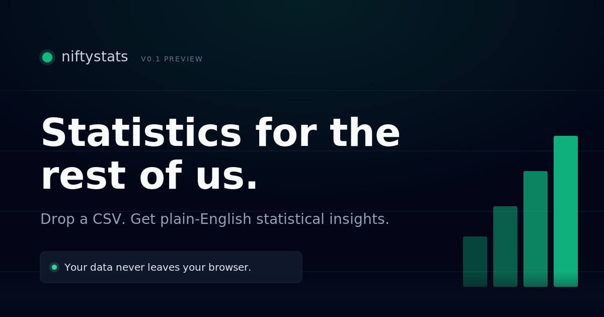

# NiftyStats

<p align="center">
  
</p>

<p align="center">
  <strong>Statistical analysis that runs entirely in your browser.</strong><br>
  Drop in a CSV or Excel file, get descriptive stats, correlations, regression, time-series trends, and clustering, each explained in plain English.
</p>

<p align="center">
  <a href="https://igorcsis.github.io/niftystats/"><strong>Live demo</strong></a>
  &nbsp;•&nbsp;
  <a href="./ARCHITECTURE.md">Architecture</a>
</p>

---

## What it does

Drop a spreadsheet on the page. NiftyStats sniffs column types, runs a full Python statistical engine on the data inside your browser, and returns a dashboard you can read top to bottom without a stats background. Every chart sits next to a short narrative that says what it actually means.

The privacy angle is the point. Nothing is uploaded anywhere. The math happens inside a WebAssembly Python runtime living in the tab. Close the tab and your data is gone with it.

## Features

- Drag-and-drop ingestion for CSV and Excel (.xlsx), with type sniffing for numeric, categorical, datetime, and boolean columns
- Per-column descriptive stats: distributions, percentiles, missing-value reports, outlier detection
- Correlation matrix (Pearson and Spearman) with heatmap and weak-pair filtering
- Linear regression with coefficients and prediction intervals
- Logistic regression with manual Wald-test p-values and an overfitting guard for small samples
- Time-series trend detection with 95% prediction intervals
- K-means clustering with silhouette-based k selection and PCA projection
- Plain-English narratives generated deterministically from result thresholds, no LLM calls, same input gives same output
- One-click branded PDF export with per-block pagination

## How it's built

NiftyStats is a static React app with a Python statistics engine running inside the browser via Pyodide. There is no backend. GitHub Pages serves the bundle, Pyodide loads pandas, numpy, scipy, and scikit-learn on first upload, and a templated narrative layer turns the result object into readable prose.

See [ARCHITECTURE.md](./ARCHITECTURE.md) for the full data flow and folder map.

## Tech stack

- **Frontend:** Vite, React 19, TypeScript, Tailwind v4
- **Stats engine:** Pyodide (pandas, numpy, scipy, scikit-learn)
- **Charts:** Plotly.js
- **File parsing:** PapaParse for CSV, SheetJS for Excel
- **PDF export:** html-to-image + jsPDF
- **Hosting:** GitHub Pages via GitHub Actions

## Running locally

```powershell
# from the project root
pnpm install
pnpm dev          # http://localhost:5173
pnpm build        # production bundle in ./dist
pnpm preview      # serve the production build locally
```

## Deploy

Pushing to `main` triggers the workflow in `.github/workflows/deploy.yml`, which builds and publishes to GitHub Pages. The site lives at https://igorcsis.github.io/niftystats/.

If you fork this, one-time repo setup: Settings → Pages → Source → "GitHub Actions".

## License

[MIT](./LICENSE).
