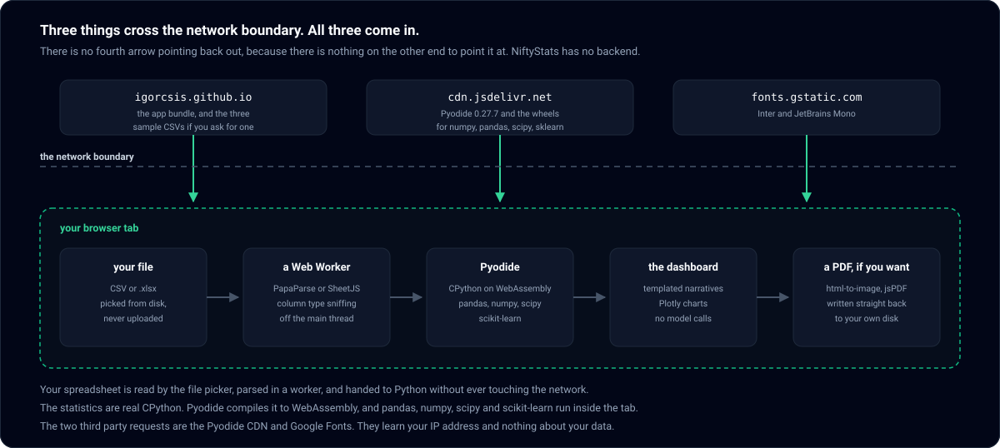
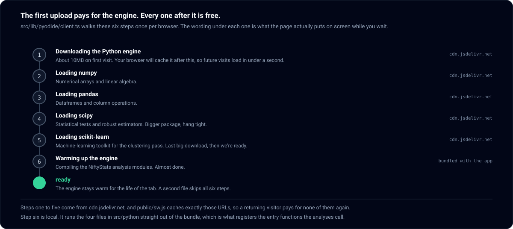

<p align="center">
  
</p>

<p align="center">
  <a href="https://github.com/IgorCSIS/niftystats/actions"></a>
  
  
  
  
</p>

# NiftyStats: a statistics dashboard that never sees your data

Drop a spreadsheet on the page and get descriptive statistics, a correlation
matrix, regression, a time-series trend and a clustering pass back, each one
sitting next to a sentence in plain English that says what it means. The maths
is real Python. It runs inside the tab.

**Live demo:** https://igorcsis.github.io/niftystats/  
**Stack:** React and Vite for the page, CPython compiled to WebAssembly for
the statistics. No account, no API key, no upload.

## The problem it solves

A small business owner exports a spreadsheet and gets stuck at the same place
every time. The numbers are all there. What is missing is somebody to say
which of them matter. The usual answers are a pivot table that answers a
question you already knew to ask, or a paid tool that wants the file uploaded
to somebody else's server first.

NiftyStats runs the analysis a statistician would run first, then writes the
answer out in a sentence. The file stays on the machine it started on.

## Where the data goes

<p align="center">
  
</p>

There is no backend to send a file to. The page is a static bundle on GitHub
Pages, and the statistics engine is CPython compiled to WebAssembly, running
in the same tab as the file picker. Nothing in `src/` calls out anywhere
except to fetch the engine itself.

Two third party requests do happen, and it would be dishonest to draw them
out of the picture: the Pyodide CDN, and Google Fonts for Inter and JetBrains
Mono. They see an IP address. They do not see a spreadsheet.

## The one-time wait

<p align="center">
  
</p>

Running real Python in a browser means downloading a real Python first. That
is a one-time cost and the page says so while it happens, step by step,
rather than parking a spinner on the screen and hoping.

`public/sw.js` caches exactly the `cdn.jsdelivr.net/pyodide/` URLs and
nothing else, so a returning visitor pays for none of it again. The app's own
assets are left to the browser's HTTP cache, where Vite's fingerprinting
already handles them.

## What you get from one file

| Pass | What it actually computes | Module |
| --- | --- | --- |
| Descriptive | Per column: mean, median, standard deviation, MAD, percentiles at 1, 5, 25, 50, 75, 95 and 99. Outliers counted two ways, by Tukey's IQR fence and by a modified Z-score at 3.5. Shapiro-Wilk normality up to 5,000 rows. A histogram capped at 40 bins | `src/python/descriptive.py` |
| Relational | Pearson and Spearman matrices with a p-value per pair, and a flag on any pair where the two disagree by more than 0.20, which is usually a curve rather than a line | `src/python/relational.py` |
| Linear regression | Ordinary least squares with standardized coefficients, t-based p-values, and a multicollinearity flag on any feature whose VIF passes 10. Needs 20 usable rows | `src/python/relational.py` |
| Logistic regression | Unregularized, on a boolean target, with Wald-test p-values from the inverse Fisher information. Refuses to fit under 20 usable rows or 5 in the minority class | `src/python/relational.py` |
| Time series | A `scipy.stats.linregress` trend per numeric column, needing at least 10 points, forecasting ahead by a quarter of the series up to 12 points, with a 95% band from the residual standard error | `src/python/timeseries.py` |
| Clustering | K-means for k from 2 to 8, picking k by silhouette score and flagging anything under 0.25 as a weak split. PCA to two dimensions for the scatter plot only, never for the clustering itself | `src/python/clustering.py` |

Every one of those numbers then goes through a narrative layer that turns it
into a sentence. The narratives are templates keyed off thresholds, so the
same file always produces the same words.

## What it deliberately does not do

- **It does not upload your file.** There is nowhere for it to go. See the
  diagram above.
- **It does not call a language model.** The plain-English layer is
  `src/lib/narratives/`, a set of templates driven by the numbers. Same input,
  same sentence, every time, offline.
- **It does not remember anything.** No account, no `localStorage`, no
  database. Close the tab and the data is gone with it.
- **It does not handle very large files.** PapaParse in worker mode is
  comfortable to roughly a hundred thousand rows. Past that the engine would
  need a chunked pass it does not have yet.
- **It does not replace a statistician** on a decision that matters. It runs
  the first pass and tells you where to look.

## Running it locally

```bash
pnpm install
pnpm dev        # http://localhost:5173
pnpm lint       # eslint over the whole tree
pnpm build      # production bundle in ./dist
pnpm preview    # serve that bundle locally
```

The Python modules are audited separately, because they follow the Appendix A
conventions rather than the surrounding TypeScript style:

```bash
python tools/appendix_a_audit.py src/python/*.py
```

Both the lint and the audit run in CI on every push.

## Layout

```
niftystats/
├── index.html                        the shell and the font preconnects
├── src/
│   ├── main.tsx                      mounts React, registers the service worker
│   ├── App.tsx                       the single route
│   ├── pages/Landing.tsx             the upload screen and the dashboard below it
│   ├── components/
│   │   ├── upload/                   drop zone, sample buttons, engine status
│   │   ├── dashboard/                one section per analysis pass
│   │   ├── charts/                   the Plotly wrappers and their shared theme
│   │   └── layout/                   header and footer
│   ├── lib/
│   │   ├── pyodide/                  the engine bootstrap, and its status feed
│   │   ├── narratives/               the plain English layer, one file per pass
│   │   ├── pdf/                      the export, html-to-image into jsPDF
│   │   └── csv.ts                    hands a file to the worker and waits
│   ├── python/                       the four analysis modules, run inside Pyodide
│   ├── workers/                      PapaParse or SheetJS, and the type sniff
│   └── types/                        the contract between the two languages
├── public/
│   ├── sw.js                         caches the Pyodide CDN payload, nothing else
│   └── samples/                      three fictional CSVs, 20 to 30 rows each
├── tools/appendix_a_audit.py         the Python style audit CI runs
└── assets/                           the diagrams in this README
```

`ARCHITECTURE.md` has the longer version: the data flow, the boundaries
between the layers, and what is deliberately left for later.

## The sample data

Three fictional CSVs ship with the app, reachable from the buttons under the
drop zone:

| File | Rows | Shape |
| --- | --- | --- |
| `sales-sample.csv` | 20 | A date, marketing spend, revenue, customers, channel |
| `marketing-sample.csv` | 20 | Campaign, channel, impressions, clicks, conversions, spend, start date, active |
| `customers-sample.csv` | 30 | Customer id, signup date, age, plan, monthly revenue, support tickets, churned |

The companies, the customers and the numbers are all invented. They exist to
exercise the analysis paths, not to describe anybody.

## Deploying your own copy

Push to `main` and `.github/workflows/deploy.yml` lints, audits, builds and
publishes `dist/` to GitHub Pages. Vite is configured with
`base: '/niftystats/'`, so asset paths resolve under the Pages subpath.

If you fork this, there is one manual step: **Settings, then Pages, then
Source, then "GitHub Actions"**.

One thing to keep in sync if you upgrade: `src/lib/pyodide/client.ts` hard
codes the CDN URL for a specific Pyodide version, and `package.json` pins the
matching JS bindings exactly. Bump both together or the wasm runtime and the
bindings will disagree.

## License

[MIT](./LICENSE).
